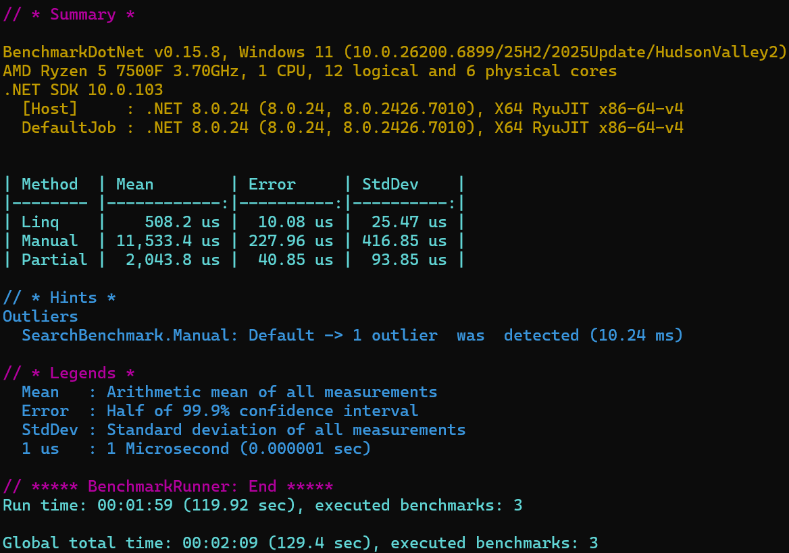
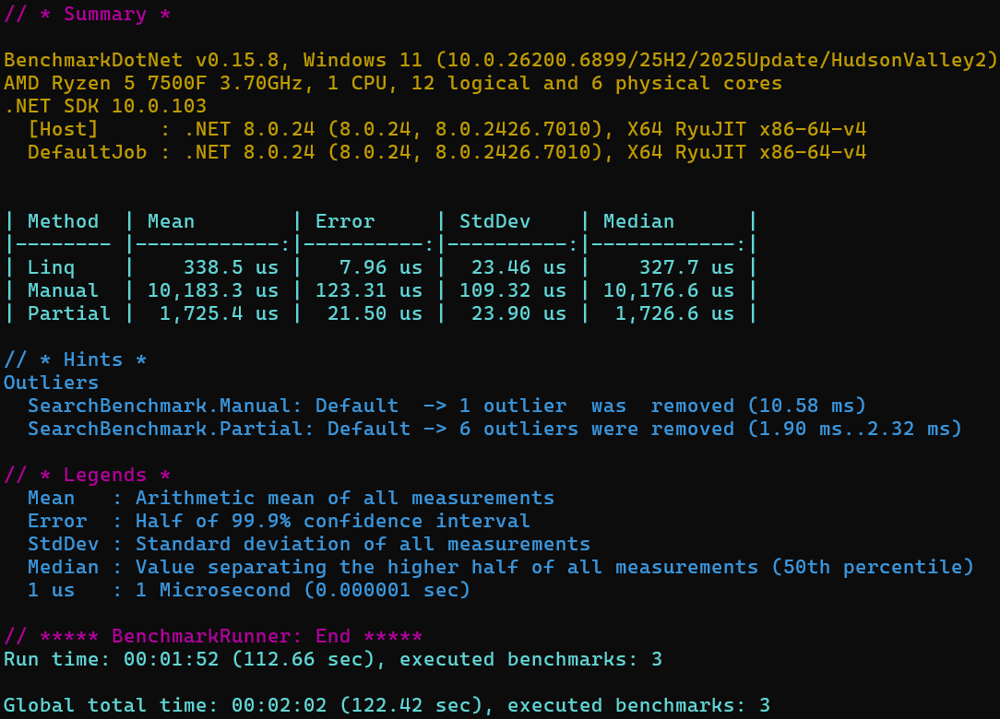
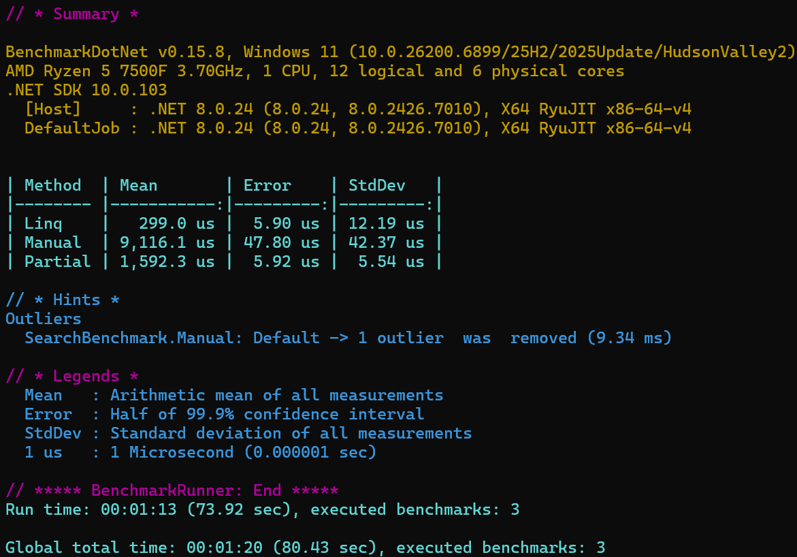
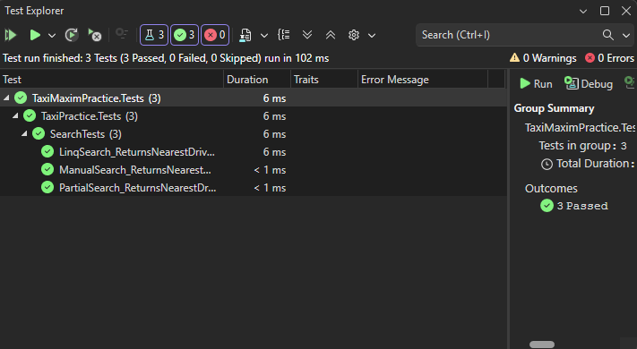
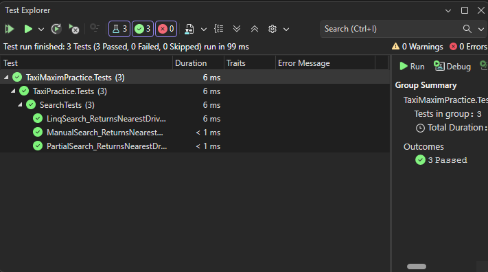
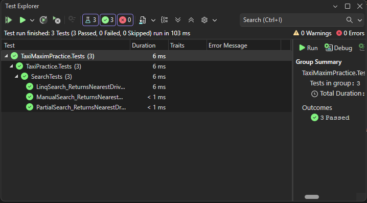

# TaxiMaximPractice

## Описание проекта

Данный проект реализует механизм подбора ближайших водителей такси к заказу на прямоугольной карте размером N x M.

Каждый водитель имеет уникальный идентификатор и координаты расположения на карте. Координаты задаются в виде целочисленных значений X и Y.

Основная задача проекта — определить пять ближайших водителей к точке заказа с использованием различных алгоритмов поиска и сравнить их производительность.

Проект разработан на языке C# с использованием платформы .NET 8.

---

## Реализованные алгоритмы

### 1. LINQ Search

Алгоритм использует LINQ-сортировку списка водителей по расстоянию до точки заказа.

Принцип работы:

* для каждого водителя вычисляется расстояние до заказа;
* список сортируется методом OrderBy();
* выбираются первые пять элементов.

Преимущества:

* простой и читаемый код;
* высокая удобочитаемость.

Недостатки:

* сортируется весь список полностью;
* может работать медленнее на больших объемах данных.

---

### 2. Manual Sort Search

Алгоритм использует стандартный метод List.Sort() с пользовательским сравнением расстояний.

Принцип работы:

* вычисляются расстояния до точки заказа;
* список сортируется вручную через компаратор;
* выбираются пять ближайших водителей.

Преимущества:

* более гибкое управление сортировкой;
* меньшие накладные расходы по сравнению с LINQ.

Недостатки:

* также выполняется полная сортировка списка.

---

### 3. Partial Search

Алгоритм реализует частичный поиск минимального расстояния без полной сортировки списка.

Принцип работы:

* выполняется поиск ближайшего водителя;
* найденный водитель исключается из дальнейшего поиска;
* процесс повторяется до нахождения пяти ближайших водителей.

Преимущества:

* отсутствует необходимость полной сортировки;
* более высокая производительность при малом количестве необходимых результатов.

Недостатки:

* более сложная реализация.

---

## Тестирование

Для проверки корректности работы алгоритмов использовалась библиотека NUnit.

Тестирование включает:

* проверку корректного количества найденных водителей;
* проверку правильности сортировки по расстоянию;
* проверку корректной работы всех реализованных алгоритмов.

---

## Benchmark

Для сравнения производительности алгоритмов использовалась библиотека BenchmarkDotNet.

Ниже представлены результаты измерения производительности алгоритмов.

---

## Результаты тестирования (NUnit)

